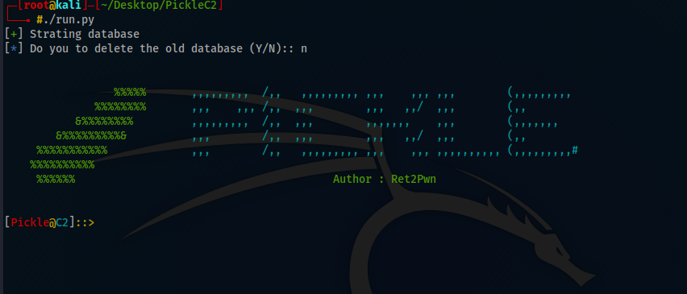

# PickleC2
PickleC2 is a post-exploitation and lateral movements framework  


## Documentation

## Overview

PickleC2 is a simple C2 framework written in python3 used to help the community in Pentreation Testers in there red teaming engagements.  

PickleC2 has ability to import your own powershell module for Post-Exploitation and Lateral Movemnet or automate process.   

## Features 

There is a one implant for the beta version which is powershell.   

1. PickleC2 is fully encrypted communications, protecting the confidentiality and integrity of the C2 traffic even when communicating over HTTP.

2. PickleC2 can handle multiple listeners and implants with no issues

3. PickleC2 supports anyone who would like to add his own PowerShell Module

## Future Features

In the up coming updates pickle will support:   

1. Go Implant

2. Powershell-Less Implant that don’t use System.Management.Automation.dll.

3. Malleable C2 Profile will be supported.

4. HTTPS communications will be supported. NOTE: Even HTTP communications is fully encrypted.

## Install

```bash
git clone https://github.com/xRET2pwn/PickleC2.git
cd PickleC2
sudo apt install python3 python3-pip
python3 -m pip install -r requirements.txt
./run.py
```

